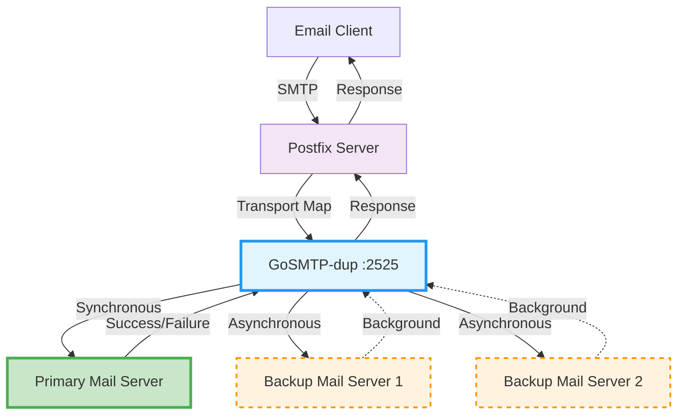

# SMTP Duplicator (gosmtp-dup)

An SMTP relay server that duplicates incoming emails to multiple destinations - one primary server and multiple backup servers.

## Overview

This Go application acts as an SMTP proxy that receives emails and forwards them to:
- **Primary destination**: Critical delivery - if this fails, the original email sending fails
- **Backup destinations**: Additional copies sent asynchronously for redundancy

The main purpose of this program is to enable **smooth migration from one mail server to another** (or multiple servers) by duplicating traffic in real-time. This allows you to gradually transition your mail infrastructure while ensuring no emails are lost during the migration process.

## Architecture



**Flow:**
1. Email clients send to Postfix
2. Postfix routes via transport maps to GoSMTP-dup
3. GoSMTP-dup sends synchronously to primary server (must succeed)
4. GoSMTP-dup sends asynchronously to backup servers (failures logged only)
5. Response based on primary server result

## Features

- ✅ **Dual delivery mode**: Synchronous primary, asynchronous backups
- ✅ **High availability**: Email redundancy across multiple servers
- ✅ **Environment variables**: Configure via env vars or YAML
- ✅ **Docker ready**: Multi-architecture containers
- ✅ **Postfix integration**: Easy integration with existing mail servers
- ✅ **Structured logging**: Comprehensive logging with Zap

## Documentation

📖 **Complete documentation available at: [https://cabonemailserver.github.io/GoSMTP-dup/](https://cabonemailserver.github.io/GoSMTP-dup/)**

### Quick Links

| Topic | Description |
|-------|-------------|
| [Installation](https://cabonemailserver.github.io/GoSMTP-dup/docs/installation.html) | Binary, Docker, and source installation |
| [Configuration](https://cabonemailserver.github.io/GoSMTP-dup/docs/configuration.html) | YAML configuration options and examples |
| [Environment Variables](https://cabonemailserver.github.io/GoSMTP-dup/docs/environment.html) | Complete env var configuration guide |
| [Docker Usage](https://cabonemailserver.github.io/GoSMTP-dup/docs/docker.html) | Docker, Docker Compose, and Kubernetes |
| [Postfix Integration](https://cabonemailserver.github.io/GoSMTP-dup/docs/postfix.html) | Step-by-step Postfix integration |

## Quick Start

### Docker (Recommended)

```bash
docker run -d \
  --name smtp-duplicator \
  -p 2525:2525 \
  -e SMTP_DUP_SMTP_LISTEN="0.0.0.0:2525" \
  -e SMTP_DUP_RELAY_DESTINATION_PRIMARY="primary.example.com:25" \
  -e SMTP_DUP_RELAY_DESTINATION_BACKUPS="backup1.example.com:25,backup2.example.com:25" \
  ghcr.io/cabonemailserver/gosmtp-dup:latest
```

### Binary

```bash
# Download for Linux
wget https://github.com/CaboneMailServer/GoSMTP-dup/releases/latest/download/gosmtp-dup-linux-amd64
chmod +x gosmtp-dup-linux-amd64
./gosmtp-dup-linux-amd64
```

## Basic Configuration

Create a `config.yaml` file or use environment variables:

### YAML Config
```yaml
smtp:
  listen: "0.0.0.0:2525"
  domain: "mail.example.com"
relay:
  destination_primary: "primary.example.com:25"
  destination_backups:
    - "backup1.example.com:25"
    - "backup2.example.com:25"
```

### Environment Variables
```bash
export SMTP_DUP_SMTP_LISTEN="0.0.0.0:2525"
export SMTP_DUP_RELAY_DESTINATION_PRIMARY="primary.example.com:25"
export SMTP_DUP_RELAY_DESTINATION_BACKUPS="backup1.example.com:25,backup2.example.com:25"
```

> 📚 **For detailed configuration options, migration scenarios, and advanced setups, see the [complete documentation](https://cabonemailserver.github.io/GoSMTP-dup/docs/configuration.html)**

## Use Cases

- 🔄 **Mail server migration**: Gradually migrate with real-time duplication
- 🔒 **Email backup**: Ensure delivery to multiple servers
- 📊 **Load distribution**: Distribute email load across servers
- 🚨 **Disaster recovery**: Maintain backup mail servers

## Downloads

| Platform | Download |
|----------|----------|
| Linux AMD64 | [Download](https://github.com/CaboneMailServer/GoSMTP-dup/releases/latest/download/gosmtp-dup-linux-amd64) |
| Linux ARM64 | [Download](https://github.com/CaboneMailServer/GoSMTP-dup/releases/latest/download/gosmtp-dup-linux-arm64) |
| Windows AMD64 | [Download](https://github.com/CaboneMailServer/GoSMTP-dup/releases/latest/download/gosmtp-dup-windows-amd64.exe) |
| macOS AMD64 | [Download](https://github.com/CaboneMailServer/GoSMTP-dup/releases/latest/download/gosmtp-dup-darwin-amd64) |
| macOS ARM64 | [Download](https://github.com/CaboneMailServer/GoSMTP-dup/releases/latest/download/gosmtp-dup-darwin-arm64) |

### Docker Images

- **Registry**: [ghcr.io/cabonemailserver/gosmtp-dup](https://github.com/CaboneMailServer/GoSMTP-dup/pkgs/container/gosmtp-dup)
- **Latest**: `ghcr.io/cabonemailserver/gosmtp-dup:latest`

## License

MIT License - see [LICENSE](LICENSE) file for details.

## Contributing

Contributions are welcome! Please open issues and pull requests on [GitHub](https://github.com/CaboneMailServer/GoSMTP-dup).

