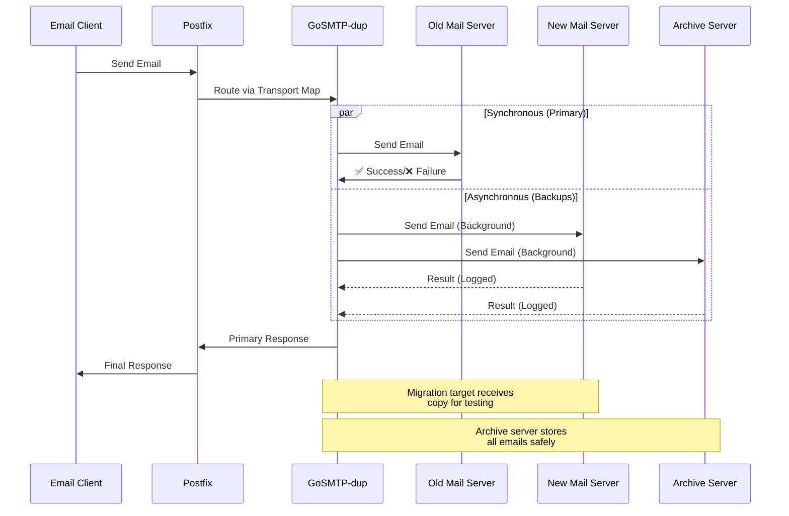

# Configuration

GoSMTP-dup can be configured using YAML files or environment variables.

## Configuration File

Create a `config.yaml` file:

```yaml
# SMTP server configuration
smtp:
  # Address and port where the SMTP duplicator will listen for incoming connections
  listen: "127.0.0.1:2525"

  # Domain name that the SMTP server announces itself as
  # This appears in the SMTP greeting (220 response) and server identification
  domain: "localhost"

# Email relay configuration
relay:
  # Primary destination server (REQUIRED)
  # Emails are sent here synchronously - if this fails, the original send fails
  destination_primary: "mailprimary.example.com:25"

  # Backup destination servers (OPTIONAL)
  # Emails are duplicated to these servers asynchronously in the background
  # Failures here are logged but don't affect the client
  destination_backups:
    - "mail_backup1.example.com:25"
    - "mail_backup2.example.com:25"

  # Timeout in seconds for relay operations
  timeout_seconds: 10
```

## Configuration Locations

The application searches for configuration files in:

1. Current directory (`./config.yaml`)
2. `/etc/smtp-dup/config.yaml`

## Configuration Options

| Option | Type | Required | Description |
|--------|------|----------|-------------|
| `smtp.listen` | string | Yes | Address and port for SMTP server |
| `smtp.domain` | string | Yes | Domain name for SMTP server identification |
| `relay.destination_primary` | string | Yes | Primary mail server (synchronous) |
| `relay.destination_backups` | array | No | Backup mail servers (asynchronous) |
| `relay.timeout_seconds` | integer | No | Timeout for relay operations (default: 10) |

## Behavior

### Primary Destination
- **Synchronous delivery**: Email is sent immediately
- **Error handling**: If delivery fails, the original SMTP transaction fails
- **Required**: Must be configured for the duplicator to work

### Backup Destinations
- **Asynchronous delivery**: Emails are sent in background goroutines
- **Error handling**: Failures are logged but don't affect the client
- **Optional**: Can be empty or omitted entirely

### Timeout
- Applied to all relay operations (both primary and backup)
- Default value: 10 seconds
- Configurable per deployment needs

## Example Configurations

### Minimal Configuration

```yaml
smtp:
  listen: "0.0.0.0:2525"
  domain: "mail.example.com"
relay:
  destination_primary: "newmail.example.com:25"
```

### Migration Configuration

```yaml
smtp:
  listen: "0.0.0.0:2525"
  domain: "mail.example.com"
relay:
  destination_primary: "oldmail.example.com:25"  # Current production
  destination_backups:
    - "newmail.example.com:25"    # Migration target
    - "archive.example.com:25"    # Archive server
  timeout_seconds: 30
```

#### Migration Flow Diagram



### High Availability Configuration

```yaml
smtp:
  listen: "0.0.0.0:2525"
  domain: "mail.example.com"
relay:
  destination_primary: "primary.example.com:25"
  destination_backups:
    - "backup1.example.com:25"
    - "backup2.example.com:25"
    - "backup3.example.com:25"
  timeout_seconds: 15
```

[← Back: Installation](installation.html) | [Next: Environment Variables →](environment.html)