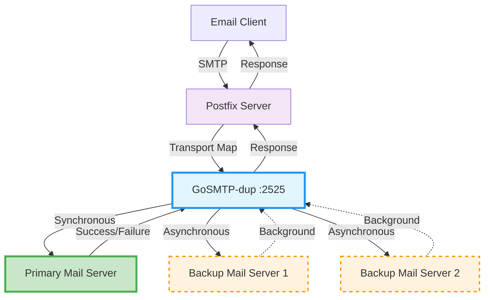

# GoSMTP-dup

An SMTP relay server that duplicates incoming emails to multiple destinations for smooth mail server migration.

## Overview

GoSMTP-dup acts as an SMTP proxy that receives emails and forwards them to multiple destinations:
- **Primary destination**: Critical delivery - if this fails, the original email sending fails
- **Backup destinations**: Additional copies sent asynchronously for redundancy

The main purpose is to enable **smooth migration from one mail server to another** by duplicating traffic in real-time.

## Architecture



**Flow Explanation:**
1. **Email clients** send emails to Postfix
2. **Postfix** routes specific domains through the duplicator via transport maps
3. **GoSMTP-dup** receives the email and:
   - Sends to **primary server** synchronously (must succeed)
   - Sends to **backup servers** asynchronously (failures logged but ignored)
4. **Response** is based only on primary server success/failure

## Quick Start

### Using Docker

```bash
# Pull the latest image
docker pull ghcr.io/cabonemailserver/gosmtp-dup:latest

# Run with environment variables
docker run -d \
  --name smtp-duplicator \
  -p 2525:2525 \
  -e SMTP_DUP_SMTP_LISTEN="0.0.0.0:2525" \
  -e SMTP_DUP_RELAY_DESTINATION_PRIMARY="mailprimary.example.com:25" \
  -e SMTP_DUP_RELAY_DESTINATION_BACKUPS="backup1.example.com:25,backup2.example.com:25" \
  ghcr.io/cabonemailserver/gosmtp-dup:latest
```

### Using Binary

Download the latest binary from [GitHub Releases](https://github.com/CaboneMailServer/GoSMTP-dup/releases):

```bash
# Linux
wget https://github.com/CaboneMailServer/GoSMTP-dup/releases/latest/download/gosmtp-dup-linux-amd64
chmod +x gosmtp-dup-linux-amd64
./gosmtp-dup-linux-amd64
```

## Features

- ✅ **Dual delivery mode**: Synchronous primary, asynchronous backups
- ✅ **High availability**: Email redundancy across multiple servers
- ✅ **Environment variables**: Configure via env vars or YAML
- ✅ **Docker ready**: Multi-architecture containers
- ✅ **Postfix integration**: Easy integration with existing mail servers
- ✅ **Structured logging**: Comprehensive logging with Zap

## Use Cases

- **Mail server migration**: Gradually migrate with real-time duplication
- **Email backup**: Ensure delivery to multiple servers
- **Disaster recovery**: Maintain backup mail servers
- **Load distribution**: Distribute email load across servers

## Documentation

- [Installation](installation.html)
- [Configuration](configuration.html)
- [Postfix Integration](postfix.html)
- [Docker Usage](docker.html)
- [Environment Variables](environment.html)

## Download

| Platform | Download |
|----------|----------|
| Linux AMD64 | [Download](https://github.com/CaboneMailServer/GoSMTP-dup/releases/latest/download/gosmtp-dup-linux-amd64) |
| Linux ARM64 | [Download](https://github.com/CaboneMailServer/GoSMTP-dup/releases/latest/download/gosmtp-dup-linux-arm64) |
| Windows AMD64 | [Download](https://github.com/CaboneMailServer/GoSMTP-dup/releases/latest/download/gosmtp-dup-windows-amd64.exe) |
| macOS AMD64 | [Download](https://github.com/CaboneMailServer/GoSMTP-dup/releases/latest/download/gosmtp-dup-darwin-amd64) |
| macOS ARM64 | [Download](https://github.com/CaboneMailServer/GoSMTP-dup/releases/latest/download/gosmtp-dup-darwin-arm64) |

## Docker Images

- **Registry**: [ghcr.io/cabonemailserver/gosmtp-dup](https://github.com/CaboneMailServer/GoSMTP-dup/pkgs/container/gosmtp-dup)
- **Latest**: `ghcr.io/cabonemailserver/gosmtp-dup:latest`

## License

Licensed under the [MIT License](https://github.com/CaboneMailServer/GoSMTP-dup/blob/main/LICENSE).

## Contributing

Contributions are welcome! Please see the [GitHub repository](https://github.com/CaboneMailServer/GoSMTP-dup) for issues and pull requests.